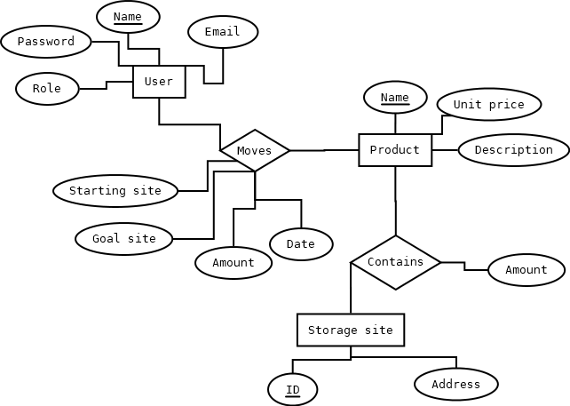

# Ráktárkezelő
Dokumentáció  
Készítette: Kulcsár Ádám László

## Szoftveres függőségek

Rust compiler  
https://www.rust-lang.org/tools/install

Tauri  
https://tauri.app/

Rust könyvtári függőségek: \
atk 0.18.0 \
cairo 0.0.4 \
soup 0.5.1 \
soup2-sys 0.2.0 \
mysql 

## Beüzemelés

## Egyed-Kapcsolat Diagram

## Adatbázis relációséma

| Normalizálás előtt: |
| --- |
| User(<u>name</u>, email, password, role) |
| Product(<u>name</u>, unit_price, description) |
| StorageSite(<u>id</u>, address)
| Transports(<u>id</u>, *User.name, Product.name, starting_site, goal_site*, date, amount)
| Contains(*<u>Storage.id</u>, <u>Product.name</u>*, amount)

{User.name}+ -> {email, password, role} \
{Product.name}+ -> {unit_price, description} \
{StorageSite.id}+ -> {address} \
{Moves.id}+ -> {User.name, Product.name, starting_site, goal_site, date, Moves.amount} \
{Storage.id, Product.name}+ -> {Contains.amount}

A séma 1NF-ben van, mivel csakis atomi attribútumokat tartalmaz. \
A séma 2NF-ben is van, mivel minden másodlagos attribútum teljesen függ a kulcsoktól. \
A séma 3NF-ben is van, mivel minden másodlagos attrubútum közvetlenül függ bármely kulcstól.

## Táblatervek

### User Tábla
| Mező neve | Típus | Megjegyzés |
| -- | -- | -- |
| <u>name</u> | varchar(60) | Felhasználó neve |
| email | varchar(255) | Felhasználó email címe |
| password | varchar(255) | Felhasználó jelszava |

### Product tábla
| Mező neve | Típus | Megjegyzés |
| -- | -- | -- |
| <u>name</u> | varchar(255) | Termék neve |
| unit_price | integer | Termék ára |
| description | varchar(255) | Termék leírása |

### Storage Site tábla
| Mező neve | Típus | Megjegyzés |
| -- | -- | -- |
| <u>id</u> | integer | Raktár azonosítója |
| address | varchar(255) | Raktár címe |

### Transports tábla
| Mező neve | Típus | Megjegyzés |
| -- | -- | -- |
| <u>shipping_id</u> | integer | Szállítás azonosítója |
| *user.name* | varchar(60) | Szállítás elrendelőjének a felhasználóneve |
| *product.name* | varchar(255) | Szállítandó árú neve |
| *starting_site* | integer | Árut tartalmazó raktár azonosítója |
| *goal_site* | integer | Szállítás célraktárjának az azonosítója |
| shipping_date | date | Szállítás elrendelésének az időpontja |

### Contains tábla
| Mező neve | Típus | Megjegyzés |
| -- | -- | -- |
| *storage_id* | integer | Tartalmazó raktár azonosítója |
| *product* | varchar(255) | Raktározott áru neve |
| amount | integer | Raktározott árú darabszáma |

## Program Funkciói

## Összetett lekérdezések
